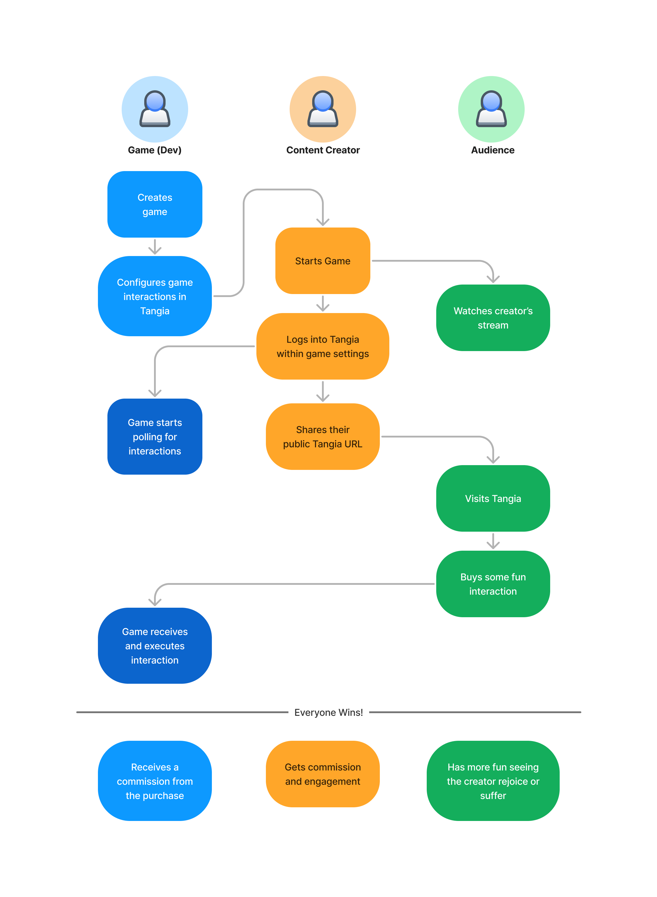

# Tangia Explained

Welcome to Tangia! We help you making your game more attractive for content creators by offering in-game interactions
that make the streams more engaging and fun to watch.

## Sounds interesting? Contact us!

Tangia is currently in invite-only beta. If you thing your game would be a great fit, drop us a line at [developers@tangia.co](mailto:developers@tangia.co) and tell us about your great game. 

We'll then invite you to our developer Discord where you can get support anytime directly from the team behind Tangia.

## How does it work

Content creators and their audiences love being able interact. 
We enable this by extending your game so that viewers can buy interactions which then trigger events inside your game that the creator is currently playing.

The diagram below shows what this looks like.

Ready to start? Then head over to [getting started](./getting-started)!

